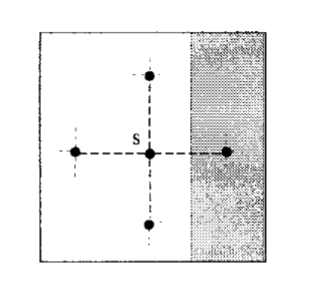

####Harvard CS205 Parallel Programming Final Project - Anisotropic Diffusion using OpenCL
============================================
### Authors
* Wenshuai Ye \<wenshuaiye@g.harvard.edu\>
* Yuhao Zhu \<yuhaozhu@g.harvard.edu\>

### Background and Motivation
In image processing and computer vision, anisotropic diffusion, also called Perona–Malik diffusion, is a technique aiming at reducing image noise without removing significant parts of the image content, typically edges, lines or other details that are important for the interpretation of the image. Mathematically, the pixels can be updated iteratively by averaging the gradients of their four neighbors, and the gradients can be approximated with the difference. g is an edge-stopping function and in our case, a Gaussian function.




### Description
This project explores different parallel implementations of robust anisotropic diffusion [1] in openCL and compares the performance of them with the serial version in python. The result of the Harvard library image shows that the serial (vectorized) version in python takes 165.980142117 seconds for 40 filter passes, whereas the openCL version speeds up more than 40 times. 

### Machine Used
Apple Apple version: OpenCL 1.2 (Feb 27 2015 01:29:10)

####The devices detected on platform Apple are:

#####Intel(R) Core(TM) i7-5557U CPU @ 3.10GHz [Type: CPU ]

Maximum clock Frequency: 3100 MHz

Maximum allocable memory size: 4294 MB

Maximum work group size 1024

#####Intel(R) Iris(TM) Graphics 6100 [Type: GPU ]

Maximum clock Frequency: 1100 MHz

Maximum allocable memory size: 402 MB

Maximum work group size 256

### Methods
####Method 1: Blockwise Parallel Programming

We partition the 2d image into multiple work groups, each with size (x, 2) where x takes in the value in [8, 16, 32, 64, 128]. We choose a relatively small height for each work group in that we read the value to the local buffer only when the one dimensional index is less than the width of the row and don't want that many threads to wait in the process. This method works best when the height of the image is relatively small.

####Method 2: Columnwise Parallel Programming

This method sacrifices parallelization for less number of workgroups in total without changing the local size. Again, the local size is (x, 2) where x takes in the value in [8, 16, 32, 64, 128], and the height of the global size equals that of the local size. Since the global size does not cover the entire image, we use a loop within each work group to update the buffer and the output image pixels. This is definitely not the best method among three. We introduce an improved version in method 3, which utilizes the index trick.

####Method 3: Columnwise Parallel Programming with Index Trick (Reused Buffer)

Because the size of our halo is greater than 0. The buffer we construct and update in the second method will have overlapped parts in the iteration. The index trick captures the feature and update the values only when necessary, as demonstrated in the image below (special thanks Ray for drawing the image).

####Method 4: Blockwise Parallel without Local Buffer

The last method is to get rid of the local buffer and read the pixel values from the global memory directly instead. Theoretically, reading from the global memory would be slow. However, in my system, this method outperforms the other three.


### Code Instructions

```
anisodiff.py
```
Serial (vectorized) version of robust anisotropic diffusion.

```
aniso_openCL.cl
```
OpenCL kernel that contains three versions of parallel programming methods. They are blockwise parallel programming, columnwise parallel programming, and columnwise parallel programming with buffer reused.

```
aniso_openCL.py
```
python driver to run cl code.

```
median_filter.cl
```
median filter OpenCL kernel

### Result
####Sample Image -- Harvard Library


#### Performance

#### Sample Image -- Forbidden City


#### Performance


### Performance Conclusion

The result from the both images shows that the last method outperforms the other two given that we optimize the workgroup. In the Harvard library case, this is followed by the method with the buffer index trick, which does a slightly better job than the rest. However, when we use a much smaller image, the block wise parallel method has the second better performance.


### References
[1] Michael J. Black, David H. Marimont, "Robust Anisotropic Diffusion", *IEEE TRANSACTIONS ON IMAGE PROCESSING*, VOL. 7, NO. 3, MARCH 1998
