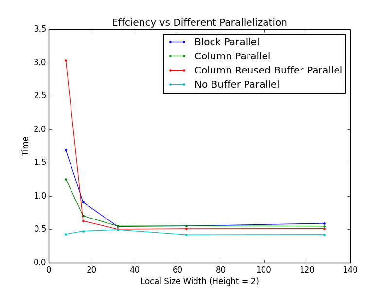

####Harvard CS205 Parallel Programming Final Project - Anisotropic Diffusion using OpenCL
============================================
### Authors
* Wenshuai Ye \<wenshuaiye@g.harvard.edu\>
* Yuhao Zhu \<yuhaozhu@g.harvard.edu\>

### Description
This project explores different parallel implementations of robust anisotropic diffusion [1] in openCL and compares the performance of them with the serial version in python.

### Instructions for running the code

```
anisodiff.py
```
Serial (vectorized) version of robust anisotropic diffusion.

```
aniso_openCL.cl
```
OpenCL kernel that contains three versions of parallel programming methods. They are blockwise parallel programming, columnwise parallel programming, and columnwise parallel programming with buffer reused.

```
aniso_openCL.py
```
python driver to run cl code.

```
median_filter.cl
```
median filter OpenCL kernel

### Result



### References
Michael J. Black, David H. Marimont, "Robust Anisotropic Diffusion", *IEEE TRANSACTIONS ON IMAGE PROCESSING*, VOL. 7, NO. 3, MARCH 1998
