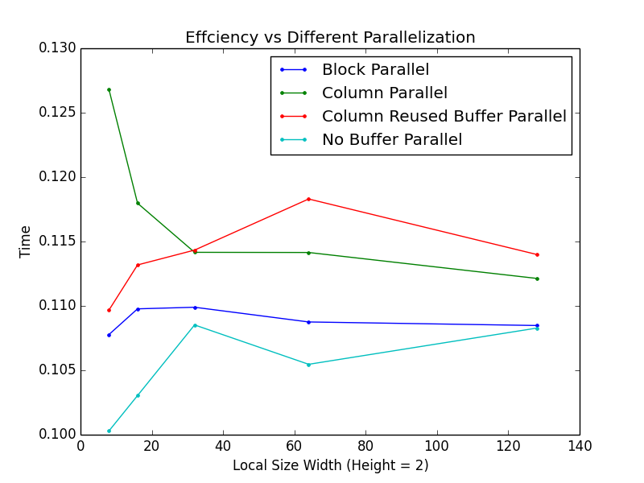

####Harvard CS205 Parallel Programming Final Project - Anisotropic Diffusion using OpenCL
============================================
### Authors
* Wenshuai Ye \<wenshuaiye@g.harvard.edu\>
* Yuhao Zhu \<yuhaozhu@g.harvard.edu\>

### Background and Motivation
In image processing and computer vision, anisotropic diffusion, also called Perona–Malik diffusion, is a technique aiming at reducing image noise without removing significant parts of the image content, typically edges, lines or other details that are important for the interpretation of the image. Mathematically, the pixels can be updated iteratively by averaging the gradients of their four neighbors, and the gradients can be approximated with the difference. g is an edge-stopping function and in our case, a Gaussian function.


### Description
This project explores different parallel implementations of robust anisotropic diffusion [1] in openCL and compares the performance of them with the serial version in python. The result of the Harvard library image shows that the serial (vectorized) version in python takes 165.980142117 seconds for 40 filter passes, whereas the openCL version speeds up more than 40 times. We use three different ways to parallelize the diffusion process in openCL. The first version parallelizes the 2d image by block and uses a local buffer to store the value. The second version parallelizes by column. Within a column (workgroup), we construct a buffer in the local memory and iteratively update the buffer and the output values. Due to the halo, there will be overlapped rows when we update the buffer within a workgroup in the second version. The third version takes advantage of this by keeping and reusing the overlapped values, therefore reducing the cost of reading them again to the local memory. The result from the Harvard library image shows that the third method slightly outperforms the other two given that we optimize the workgroup. However, when we used a much smaller image, the block wise parallel method has better performance.

### Code Instructions

```
anisodiff.py
```
Serial (vectorized) version of robust anisotropic diffusion.

```
aniso_openCL.cl
```
OpenCL kernel that contains three versions of parallel programming methods. They are blockwise parallel programming, columnwise parallel programming, and columnwise parallel programming with buffer reused.

```
aniso_openCL.py
```
python driver to run cl code.

```
median_filter.cl
```
median filter OpenCL kernel

### Result
####Sample Image -- Harvard Library


#### Performance

#### Sample Image -- Forbidden City


#### Performance


### References
Michael J. Black, David H. Marimont, "Robust Anisotropic Diffusion", *IEEE TRANSACTIONS ON IMAGE PROCESSING*, VOL. 7, NO. 3, MARCH 1998
